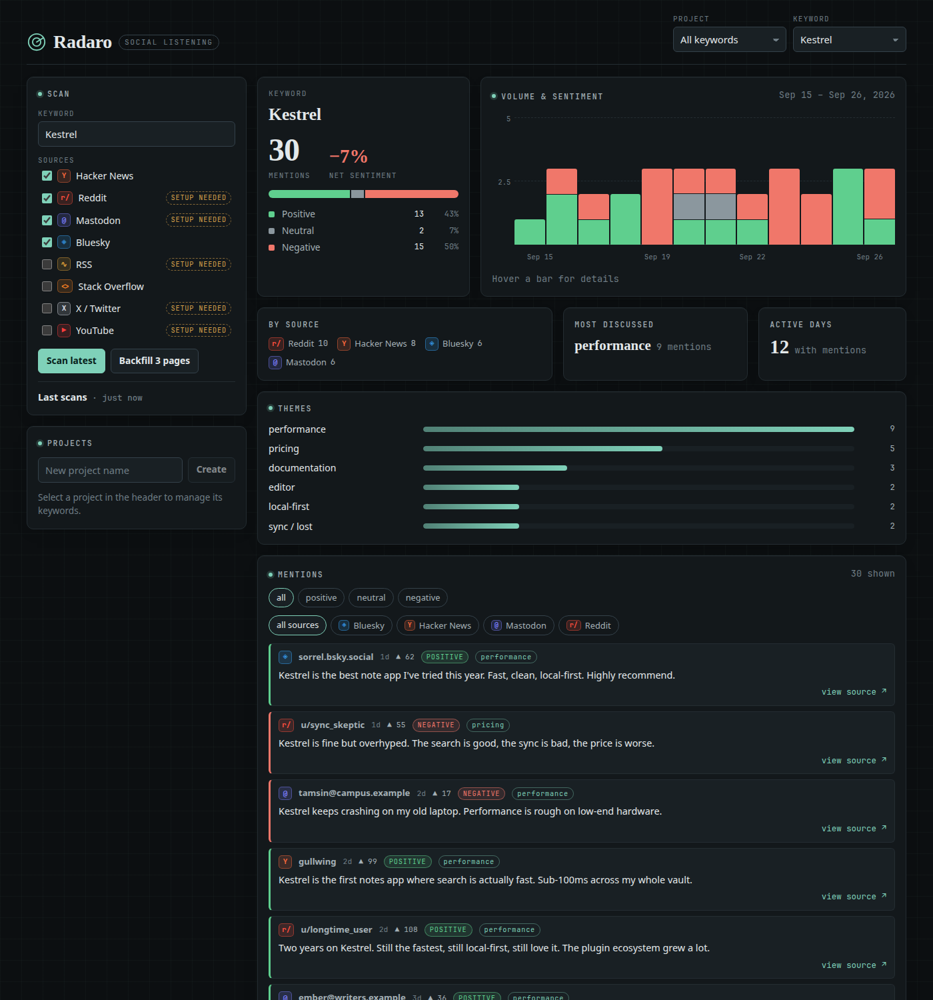

# Radaro

**Self-hosted social listening and publishing in one binary.** Track what people say about a keyword, brand or product across Hacker News, Reddit, Bluesky, Mastodon, Stack Overflow, RSS, X and YouTube. Radaro scores sentiment, clusters themes and shows it all in a local dashboard. When you want to answer a thread or announce something, draft the post, approve it, and publish it to Reddit, Bluesky, Mastodon or Dev.to from the same binary. It has no account and no telemetry, and the SQLite database stays on your machine.



- **One binary.** Go, pure-Go SQLite, dashboard embedded. No Python, Node or runtime to install.
- **Zero-config first run.** `radaro demo` works offline. Hacker News, Bluesky and Stack Overflow need no keys.
- **Incremental + backfill scanning.** Durable per-source cursors catch up new mentions and walk back through history without re-fetching.
- **Local analysis.** Sentiment (lexicon with negation, intensifiers and contrast) and theme clustering run without any model. An LLM (Anthropic, OpenAI-compatible or local Ollama) is optional.
- **Alerts.** Slack / generic webhook and SMTP email for new negative mentions, volume spikes and sentiment drops. Delivery is durable: failed alerts retry on the next scan.
- **Publishing with a human in the loop.** Drafts must be approved before `radaro publish` sends them. Replies go into the original thread, and engagement metrics are read back.
- **Agent-friendly CLI.** Every read command supports `--json`, so a coding agent (Claude Code, Codex, …) can find opportunities and write drafts for you to approve.

## Install

```bash
curl -fsSL https://raw.githubusercontent.com/verrloren/radaro/main/install.sh | sh
```

The script picks the right binary for your OS and CPU (Linux and macOS, amd64 and arm64), verifies its checksum, and installs it to `/usr/local/bin` or `~/.local/bin`. Other options:

- **Homebrew (macOS and Linux):** `brew tap verrloren/radaro https://github.com/verrloren/radaro && brew install radaro`
- **Windows or manual:** download an archive from [Releases](https://github.com/verrloren/radaro/releases) and check it against `checksums.txt`.
- **From source:** `go install github.com/verrloren/radaro/cmd/radaro@latest` (Go 1.25+).

## Quickstart

```bash
radaro demo                         # synthetic dataset → dashboard at http://127.0.0.1:8042
radaro track "arch linux"           # live scan (Hacker News + Bluesky by default)
radaro serve                        # open the dashboard
```

To build from source, run `make build`. To run it in Docker, use `docker compose up -d`.

All state lives in one database in your data directory (`~/.local/share/radaro/radaro.db` on Linux, `~/Library/Application Support/radaro` on macOS, `%LocalAppData%\radaro` on Windows), so it is shared across working directories. Override the directory with `RADARO_HOME` or the database with `--db` / `RADARO_DB`. A `.env` there (or in the current directory) is loaded automatically. `radaro status` shows what is set up.

## Use it from your coding agent

Radaro ships an [Agent Skill](skills/radaro/SKILL.md) that teaches Claude Code, Codex and other skill-aware agents the whole loop: find threads where your project is relevant, write a tailored draft per community, **stop for your approval**, publish only what you approved, and report the results.

```bash
radaro skill install                 # into ~/.claude/skills and/or ~/.codex/skills (whichever exist)
# or, in Claude Code:
/plugin marketplace add verrloren/radaro
/plugin install radaro@radaro
```

Then ask your agent something like *"promote my project https://github.com/me/thing with radaro"*. The skill forbids approving or publishing without your explicit "yes" per draft, and it never asks you to paste API keys into the chat: you connect accounts yourself with `radaro connect`.

## Commands

| Command | What it does |
|---|---|
| `radaro demo` | Load a bundled synthetic dataset and open the dashboard |
| `radaro track <keyword>` | Fetch new mentions, analyze, store, alert (`--sources`, `--limit`, `--pages`, `--project`) |
| `radaro backfill <keyword>` | Fetch older pages via saved cursors (`--pages`) |
| `radaro watch <keyword>` | Scan on an interval (`--every 900`, `--runs N`) |
| `radaro report [keyword]` | Sentiment, sources, top themes and quotes |
| `radaro serve` | Local dashboard + JSON API (`--port 8042`, `--host 127.0.0.1`) |
| `radaro project list\|create\|add\|remove\|delete\|report` | Group keywords and report across them |
| `radaro export [keyword]` | Full records as JSON or CSV (`-f csv -o file.csv`) |
| `radaro sources` | Available sources and whether they are configured |
| `radaro test-alert` | Send a synthetic alert (`--transport webhook\|email`, `--kind negative\|volume\|sentiment`) |
| `radaro connect bluesky\|mastodon\|devto\|reddit` | Connect a publishing account |
| `radaro accounts` | List connected accounts (`accounts remove <id>`) |
| `radaro opportunities [keyword]` | Recent mentions that have no draft yet (`--days`, `--source`) |
| `radaro draft add\|list\|show\|edit\|approve\|skip` | Write and review posts and replies |
| `radaro publish <draft-id>` | Publish an approved draft |
| `radaro stats` | Engagement of everything published |
| `radaro activity` | Log of what was drafted, approved and published |
| `radaro status` | Database path, configured sources, accounts, keywords, drafts |
| `radaro skill install\|show` | Install the agent skill into Claude Code / Codex |

Global flags: `--db <path>` (default: `radaro.db` in the data directory, or `$RADARO_DB`) and `--json`.

## Sources

| Source | Needs |
|---|---|
| Hacker News | nothing (Algolia API) |
| Bluesky | nothing (public AppView; the anonymous API serves only the latest page, so no deep backfill) |
| Stack Overflow | nothing (anonymous daily quota applies) |
| Reddit | `RADARO_REDDIT_CLIENT_ID` + `RADARO_REDDIT_CLIENT_SECRET`, or `RADARO_REDDIT_ACCESS_TOKEN` |
| Mastodon | `RADARO_MASTODON_ACCESS_TOKEN` (+ `RADARO_MASTODON_INSTANCE`) |
| RSS / Atom | `RADARO_RSS_FEEDS` |
| X | `RADARO_X_BEARER_TOKEN` (API v2 recent search) |
| YouTube | `RADARO_YOUTUBE_API_KEY` |

A failing source never sinks a scan. Its error is recorded and the other sources still land. Every option is listed in [`.env.example`](.env.example).

## Alerts

Set `RADARO_WEBHOOK_URL` (a Slack incoming webhook or any HTTP endpoint), or set `RADARO_EMAIL_TO`, `RADARO_EMAIL_FROM` and `RADARO_SMTP_HOST`. On each scan:

- newly ingested **negative mentions** are batched per target;
- optional thresholds fire on a **volume spike** (`RADARO_ALERT_VOLUME_MULTIPLIER`) or a **net-sentiment drop** (`RADARO_ALERT_SENTIMENT_DROP`), compared with the preceding windows, with a cooldown.

Delivery state lives in SQLite, so nothing is sent twice and failures are retried. Check your setup with `radaro test-alert`.

## Publishing

Radaro talks to each platform's API directly. You connect your own accounts, and credentials stay in the local database, which is made readable only by you.

| Platform | Connect | Posts | Replies | Metrics |
|---|---|---|---|---|
| Bluesky | `radaro connect bluesky --handle you.bsky.social` + an [app password](https://bsky.app/settings/app-passwords) | ✓ (links and hashtags are clickable) | ✓ | likes, reposts, replies, quotes |
| Mastodon | `radaro connect mastodon --instance mastodon.social` + an access token (Preferences → Development, scopes `read write:statuses`) | ✓ | ✓ (remote threads are resolved) | favourites, reblogs, replies |
| Reddit | create an app at [reddit.com/prefs/apps](https://www.reddit.com/prefs/apps) with redirect `http://127.0.0.1:8765/callback`, then `radaro connect reddit --client-id <id>` and approve in the browser | ✓ self posts | ✓ posts and comments | score, comments, upvote ratio |
| Dev.to | `radaro connect devto` + an API key (Settings → Extensions) | ✓ articles (`--community` = tags) | — | views, reactions, comments |

Secrets are read from a hidden prompt, or from stdin when piped (`echo "$TOKEN" | radaro connect devto`).

```bash
radaro track "your-product" --sources hackernews,bluesky,reddit
radaro opportunities --days 7                  # threads worth answering
radaro draft add --platform reddit --mention <id> --body-file reply.md   # reply in that thread
radaro draft add --platform bluesky --body "Radaro 0.2 is out: https://…"
radaro draft show 1 && radaro draft approve 1  # nothing is sent before approval
radaro publish 1
radaro stats
```

Drafts go `draft → approved → publishing → published` (or `failed`, which you can approve again after fixing). A draft is claimed before the network call, so a crash cannot silently post it twice. Editing an approved draft sends it back to review. Follow each community's rules: automated self-promotion gets accounts banned.

## HTTP API

`radaro serve` exposes the JSON API the dashboard uses, documented in [docs/API.md](docs/API.md). The server binds to `127.0.0.1` and has no authentication. If you expose it, put it behind an authenticated reverse proxy.

## Development

```bash
make test        # go test ./...
make web         # rebuild the React dashboard into web/dist (committed, embedded via go:embed)
make build       # ./radaro
npm --prefix web run dev   # dashboard dev server with /api proxied to 127.0.0.1:8042
```

## Credits

Radaro is an independent Go rewrite inspired by [Harken](https://github.com/VladUZH/harken) (MIT). Its source adapters, cursor-based scanning, lexicon sentiment analyzer and theme clustering are ported from Harken. See [NOTICE](NOTICE).

## License

MIT, see [LICENSE](LICENSE).
